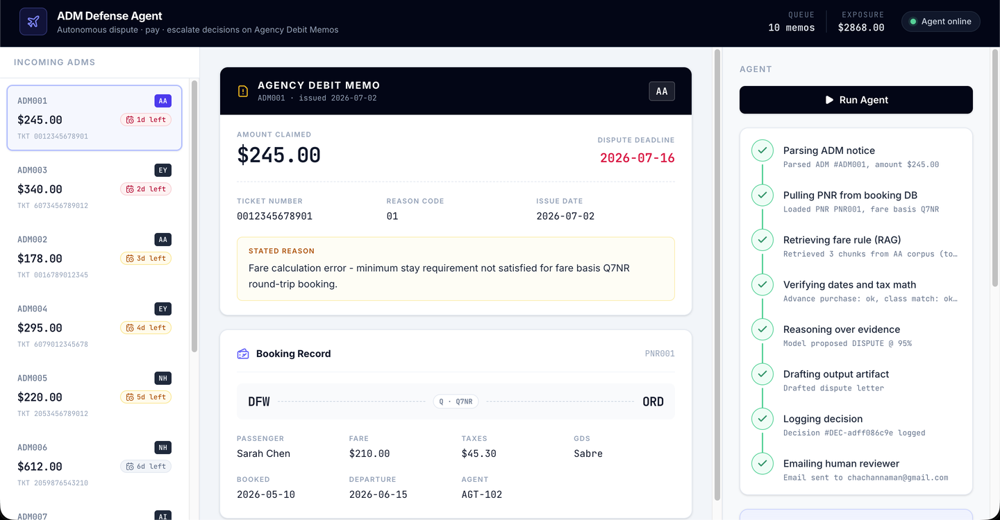
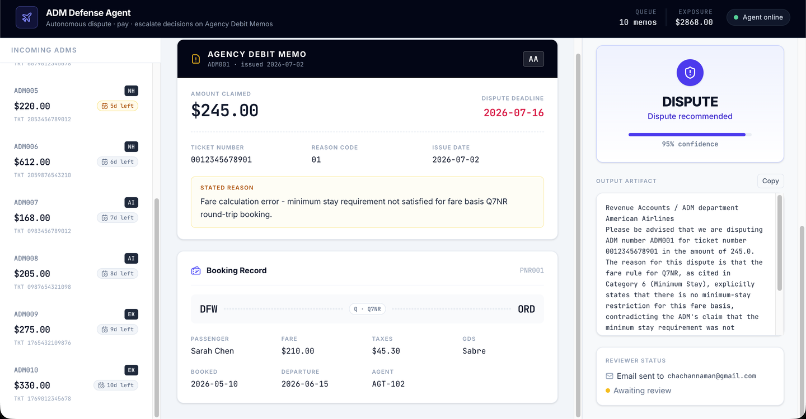

<div align="center">

# ✈️ ADM Defense Agent

**An autonomous agent that defends travel agencies against airline fines — and knows when not to.**

Parses incoming Agency Debit Memos, verifies the airline's claim against the actual booking and published fare rules, then decides `DISPUTE` / `PAY` / `ESCALATE` — with every decision routed to a human reviewer by email before anything ships.

[](https://github.com/langchain-ai/langgraph)
[](https://fastapi.tiangolo.com/)
[](https://react.dev/)
[](https://www.trychroma.com/)
[](LICENSE)

[**▶ Watch the demo**](https://drive.google.com/file/d/1o51QL0Luybmteu13k9QC4S9N8YnOKv2e/view?usp=drive_link)

</div>

---


<p align="center"><em>The agent thinking in real time — each LangGraph node streams over WebSocket as it runs.</em></p>

## The problem

Airlines issue **Agency Debit Memos** when they detect ticketing errors — fare calculation mistakes, rule violations, under-collected taxes. A mid-size consolidator sees thousands per month at ~$269 average, each with a **14-day dispute window**. Every ADM either drains margin (paid without checking) or eats analyst hours (disputed manually). At scale this is a direct P&L leak.

The agent automates the *verification and drafting* work — and hands the final call to a human.

## How a run works

```
parse_adm → lookup_booking → retrieve_rule → verify_calculation → analyze
     ├─→ DISPUTE  → draft_letter      ┐
     ├─→ PAY      → draft_pay_auth    ├─→ submit_decision → notify_reviewer
     └─→ ESCALATE → open_case         ┘
```

1. **Parse** the ADM — ticket number, reason code, amount, deadline
2. **Pull the PNR** — the actual booking record the airline is claiming against
3. **Retrieve the fare rule** — RAG over the airline's published fare rules (Chroma + BGE embeddings, filtered by airline)
4. **Verify deterministically** — advance-purchase math, booking-class match, tax recalculation. Real checks in code, not LLM eyeballing
5. **Reason** — the model weighs the claim against retrieved rules and verification results
6. **Draft the artifact** — a BSPLink-ready dispute letter, a pay-authorization memo, or an escalation case file
7. **Log** the decision with its full evidence trail (SQLite audit log)
8. **Email the human reviewer** — decision, evidence, drafted artifact, and one-click action links

### The decision boundary is code, not a prompt

```python
if amount_claimed > $500:        → ESCALATE
if confidence < 0.70:            → ESCALATE
if no strong fare-rule match:    → ESCALATE
```

These overrides run *after* the LLM call, in plain Python. The model cannot talk its way past them.


<p align="center"><em>DISPUTE at 95% confidence, drafted letter ready, reviewer emailed — awaiting their click.</em></p>

## Human-in-the-loop by design

Every decision emails a reviewer **before anything is submitted anywhere**. Routing depends on decision type:

| Decision | Goes to | Why |
|---|---|---|
| `DISPUTE` | Ops team lead | Reviews the letter before BSPLink submission |
| `PAY` | Finance manager | Signs off before money moves |
| `ESCALATE` | Senior analyst | Takes ownership of the ambiguous case |

The email carries the full evidence package and **Approve / Reject / Request-info** links that hit the backend directly — the UI polls and reflects the reviewer's action within 3 seconds. The agent does the work; the human owns the decision.

## Tech stack

| Layer | Choice |
|---|---|
| Agent framework | LangGraph (`StateGraph`, conditional edges, custom stream events) |
| LLM | Groq (`llama-3.3-70b-versatile`) — OpenRouter switchable via one env var |
| Backend | FastAPI + WebSocket streaming |
| RAG | Chroma + BGE-small embeddings (fastembed), metadata-filtered by airline |
| Reviewer email | SMTP + Jinja2 templates (one per decision type) |
| Database | SQLite (bookings, ADMs, decision audit log) |
| Frontend | React 19 + Tailwind 4 + Vite |
| Fare rule corpus | 5 hand-authored Markdown docs (AA, EY, NH, AI, EK) |

## Quickstart

**Backend**

```bash
cd backend
python3 -m venv .venv && source .venv/bin/activate
pip install -r requirements.txt
cp .env.example .env            # then fill it in — see table below
python -m app.db.seed           # create + seed SQLite
python -m app.rag.ingest        # build the Chroma fare-rule index
uvicorn app.main:app --reload   # http://localhost:8000
```

**Frontend**

```bash
cd frontend
npm install
npm run dev                     # http://localhost:5173
```

**Environment variables** (`backend/.env`)

| Variable | Purpose |
|---|---|
| `GROQ_API_KEY` / `OPENROUTER_API_KEY` | LLM provider key (set the one you use) |
| `LLM_PROVIDER` | `groq` or `openrouter` |
| `MODEL` | Model id, relative to the active provider |
| `SMTP_USER` / `SMTP_PASSWORD` | Gmail address + [App Password](https://myaccount.google.com/apppasswords) for reviewer email |
| `FROM_EMAIL` | Sender address |
| `OPS_REVIEWER_EMAIL` / `FINANCE_REVIEWER_EMAIL` / `SENIOR_ANALYST_EMAIL` | Reviewer inboxes per decision type (one address for all three is fine for a demo) |
| `BACKEND_PUBLIC_URL` | Base URL for the approve/reject links in emails |

Email is optional — with SMTP unconfigured, runs still complete and log decisions; the notify step just reports a non-fatal warning.

## API

```
GET  /health                            liveness
GET  /adm                               list all ADMs
GET  /adm/{adm_id}                      ADM + joined PNR
POST /agent/run/{adm_id}                full synchronous run
WS   /ws/agent/{adm_id}                 stream agent steps live
GET  /decision/{decision_id}            fetch a decision (UI polls this)
GET  /decision/{decision_id}/approve    reviewer action — from the email
GET  /decision/{decision_id}/reject     reviewer action — from the email
GET  /decision/{decision_id}/request_info
```

## Repo structure

```
├── backend/
│   ├── app/
│   │   ├── agent/        # LangGraph nodes, graph, LLM client, email notify + templates
│   │   ├── rag/          # Chroma ingest + retrieval
│   │   ├── db/           # schema, seed, connection
│   │   └── routers/      # adm / agent / decision endpoints
│   ├── data/             # fare rule corpus, seed data
│   └── tests/
├── frontend/
│   └── src/              # React UI — sidebar, memo panel, agent timeline
└── docs/                 # screenshots
```

## Seed data

10 mock ADMs across 5 airlines — 5 disputable, 3 legitimate (should PAY), 2 ambiguous (should ESCALATE). The distribution matters: it proves the agent exercises judgment instead of reflexively disputing everything. The full 10/10 eval runs with `python -m app.eval_seed`.

## What's real vs. simulated

- **Real**: the LangGraph state machine, RAG pipeline (real embeddings, vector search, metadata filtering), live LLM calls, deterministic verification tools, decision boundary, SQLite audit trail, SMTP email with working approve/reject round-trip.
- **Simulated**: fare rule corpus is hand-authored (not scraped filings); BSPLink submission is not integrated; the tax table is hardcoded.

## License

MIT
